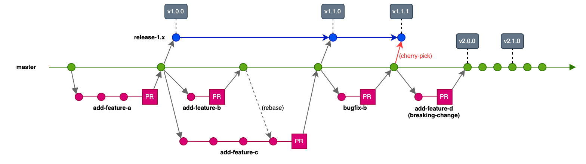

# Maintainers

Maintainers are expected to provide feedback, responses, or actions on pull requests or issues to the repository in a reasonably timely manner.

It is also recommended that you occasionally revisit the [contribution guidelines](../.github/CONTRIBUTING.md), as they are continually refined.

## PRs/issues From Others

You are welcomed to triage (attach labels to) other PRs and issues - we generally use a 1-label system (= at least 1 label per issue/PR) where the label is generic and more specific ones can be added as you see fit.

## Git Workflow

A Trunk Based Development branching strategy is used with long-lived release branches for previous major versions. (recommended)

Example workflow:



## Release Process

### Creating A New Major Version

When releasing a breaking change, our tooling will bump our major version number up by one (i.e. v1.x.x to v2.x.x).  As we will support the previous major release for a period of time, we need to create a release branch for it so that any patches can be added if required.

Prior to merging the breaking change, create a release branch as follows:

```bash
git checkout master
git pull
git checkout -b release-1.x
git push -u origin release-1.x
```

Users should be notified a new breaking change is being merged and that a release branch has been created for the previous version.

### Patch A Previous Release

There might be a need to patch a previous version that is still supported, perhaps with a bug fix or security patch.  Development of this fix would occur as usual, by creating a branch from **master** and merging the change back in to **master** when finished.
The commit then needs to be added to the release branch for the previous major version.  This is done with a `cherry-pick` as follows:

```bash
git checkout release-1.x        # Checkout the previous release branch
git log --oneline master        # View the git log on the master branch.  Copy the commit ID for your fix.
git cherry-pick [commit-id]     # Cherry-pick the single commit onto the release branch
```

Ensure a new release is created by our automation tools.
